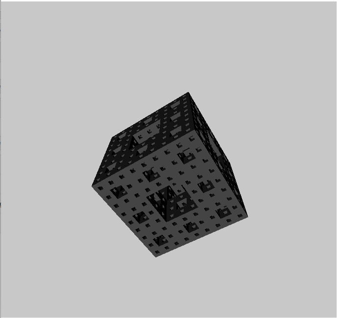

# 3rd Jan 2017

One of Dan Shiffman's "code challenges" on [his youTube channel](https://www.youtube.com/user/shiffman) had him coding a [Menger sponge](https://en.wikipedia.org/wiki/Menger_sponge). It looked fun, so I took a swing without watching his implementation.

This was fun, but it was the first time I'd used p5.js' 3D modes, and I probably should have read the docs for lighting a little closer. Still, it works.

 
