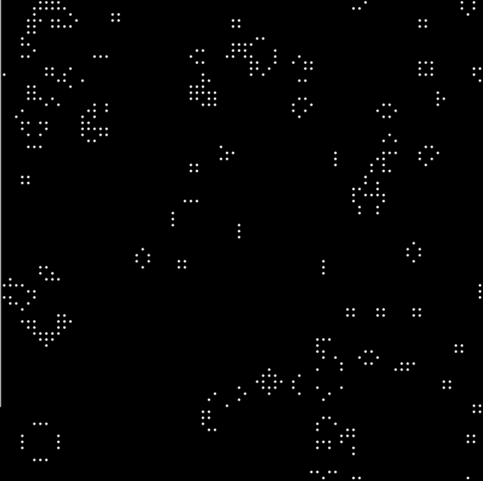

# 2nd Jan 2017

It struck me that although I've done the Game of Life Kata a number of times, I'd never actually coded a "working" game of life implementation.

This is especially weird because Conway's life comes up in a lot of philosophy I read too (think Dennett here).

 
