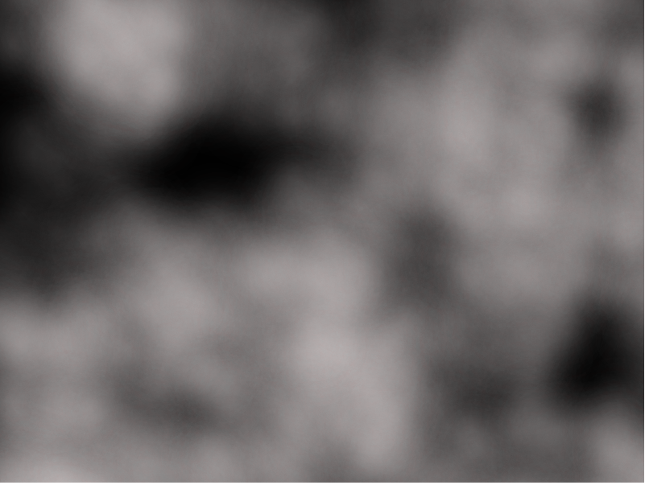

# 4th Jan 2017

I saw a cool fog effect in a game and thought it would be fun to see if I could throw together something similar.

This is a _real_ (fun) hack though, that I found [here](http://www.blog.jonnycornwell.com/2012/07/14/particle-smoke-effect/#more-77). 

Alas, no fancy physics here, more like slight of hand. In the (near?) future I'll look at some more involved particle system effects though.

 
