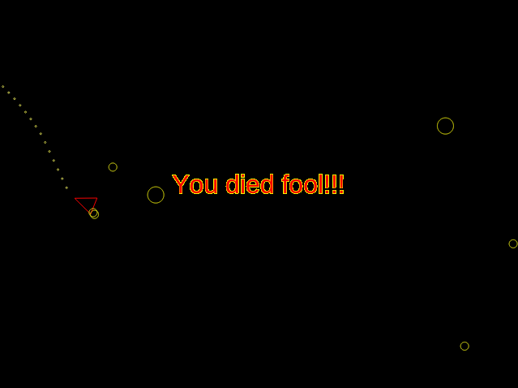

# 6th Jan 2017

Asteroids, what more is there to say?

A little bit more, actually ...

1. The game mechanics could use a lot of balancing. It's pretty easy to win.
2. The physics could use some tweaking - the ship can go _way_ too fast (I've got to put an upper bound on that).
3. The asteroids are just circles :|
4. Some sound would have been fun.
5. Jet exhausts!!!
6. Some kind of explosion when the asteroids break up.

Anyway, this was a fun one, I wasn't sure I'd get it done in an afternoon, but I'm pretty chuffed that I managed to get something playable done in a couple hours.

 
