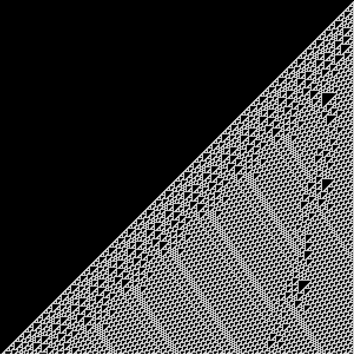

# 9th Jan 2017

Today I did an implementation of [Rule 110](https://en.wikipedia.org/wiki/Rule_110) two ways. The first using objects, the second using JS arrays.
I'm finding that while I'm doing these little sketches I'm reading quite a bit about JS, p5.js, and whatever I'm writing. Hopefully some of the stuff I'm learning will make it into my day to day practice.

 
