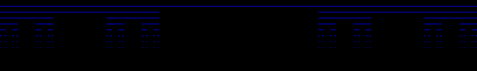

# 15th Jan 2017

Today I reread the section on fractals in Dan Shiffman's [Nature of Code](http://natureofcode.com/book/chapter-8-fractals/). In particular I wanted to make sure I understood what he says about L-systems. There are some cool examples, but I thought I'd start by having my code visualize the Cantor set using a set of basic production rules. I've augmented the code that Dan presents to encode the instructions to reduce the current line width and to advance the drawing to the next line.

 
