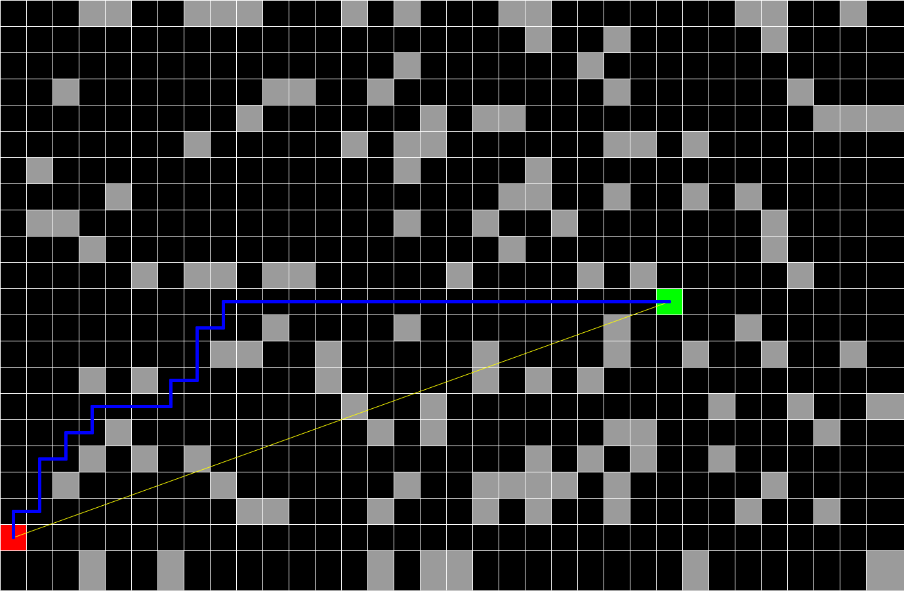

# 27 March 2017

I've written up the A* algorithm once before, but never in this context. I wanted to actually see it find the path.
As usual, this could be cleaned up quite a bit. I changed my mind about the representations I wanted to use halfway through, which is why you see the mix of vectors and SearchNodes.

¯\_(ツ)_/¯

 
